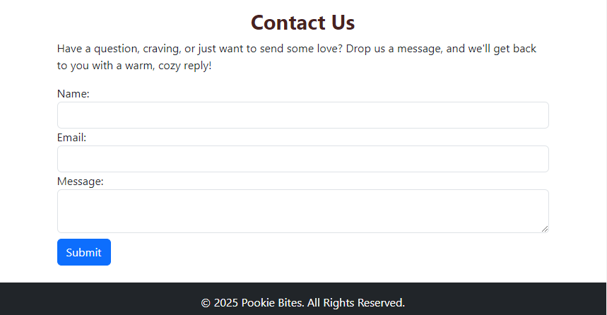

# 🐻🍓 Pookie Bites 🎀🎀 
Welcome to **Pookie Bites** – where every bite feels like a warm hug! 🥰✨  

## 🍽 About Pookie Bites  
Pookie Bites is a **delightful web-based restaurant experience** designed to make food browsing fun and adorable! Whether you're craving a **cheesy pizza hug 🍕** or a **sweet cuddle-worthy brownie 🌮**, Pookie Bites has something special for you.  

---  

## 🛠 Technologies Used  
- **HTML & CSS** 🎨  
- **JavaScript** ✨  
- **Bootstrap** for a sleek, responsive UI 📱  
- **Cute vibes & lots of love** 💕  

---  

## 📸 Screenshots  
### Homepage 🏡  
  

### Menu Section 🍕  
  

### Contact Page 📞  
  

---  

## 📂 Project Structure  
```
POOKIE-BITES/
├── assets/                   # Static assets
│   ├── pookie.png            # Adorable Pookie image
│   ├── pookiebites.png       # Pookie Bites branding image
│   ├── pookielogo3.png       # Logo for Pookie Bites
├── screenshots/              # Folder for website screenshots
│   ├── homepage.png          # Homepage preview
│   ├── menu.png              # Menu section preview
│   ├── contact.png           # Contact page preview
├── .gitattributes            # Git configuration
├── index.html                # Main webpage
├── README.md                 # Project documentation
├── styles.css                # Styling for the website
```
---  

## 📝 Installation & Usage  
### 1️⃣ Clone the repository  
```bash
git clone https://github.com/YourUsername/Pookie-Bites.git
cd Pookie-Bites
```
  
### 2️⃣ Open `index.html` in your browser  
```bash
start index.html  # On Windows
open index.html   # On Mac
```
  
### 3️⃣ Enjoy the **Pookie Bites** experience! 🎀  

---  

## 🎨 Features  
✅ **Cute & cozy restaurant website** 🎀  
✅ **Interactive menu with adorable images** 🍕🍓  
✅ **Smooth and aesthetic design** 💖  
✅ **Mobile-friendly and responsive UI** 📱  

---  

## 🤝 Contributing  
We’d love your help! 
1. **Fork the repository**  
2. **Create a new branch**  
   ```bash
   git checkout -b feature/new-feature
   ```
3. **Commit your changes**  
   ```bash
   git commit -m "Added a new feature"
   ```
4. **Push to the branch**  
   ```bash
   git push origin feature/new-feature
   ```
5. **Create a Pull Request**  

---  

## 💌 Support  
💌 Support
Need help? Want to send us some love?  Open an issue in the GitHub repository, and we'll get back to you with a warm, cozy reply! ☕💕  

🌸 **Made with love by [Akanksha Kanade](https://github.com/CandyBeans1609)** 🌸  
